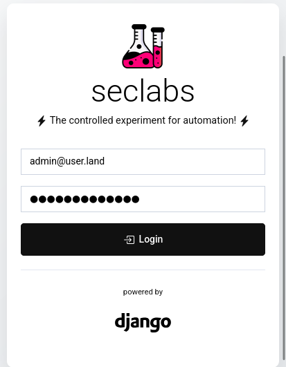

.. include:: global.rst 

.. role:: bash(code)
   :language: bash

Welcome to seclabs
===================

|made-with-sphinx-doc| |python v3.11+| |django v5.2.5+| |mit license|

.. |made-with-sphinx-doc| image:: https://img.shields.io/badge/Made%20with-Sphinx-1f425f.svg
   :target: https://www.sphinx-doc.org/

.. |python v3.11+| image:: https://img.shields.io/badge/Python-v3.11+-1abc9c.svg
   :target: https://GitHub.com/Naereen/ama

.. |django v5.2.5+| image:: https://img.shields.io/badge/Django-v5.2.5+-green.svg
   :target: https://GitHub.com/Naereen/StrapDown.js/graphs/commit-activity

.. |mit license| image:: https://img.shields.io/badge/License-MIT-blue.svg
   :target: https://lbesson.mit-license.org/

An automation platform that aims to provide **security reporting** for different popular SaaS services in a useful way. It’s written in Python and it is based on the Django Web Framework. The design is kept minimal, with seperate standalone applications within the project.

|br|
   
.. include:: structure.rst
   
